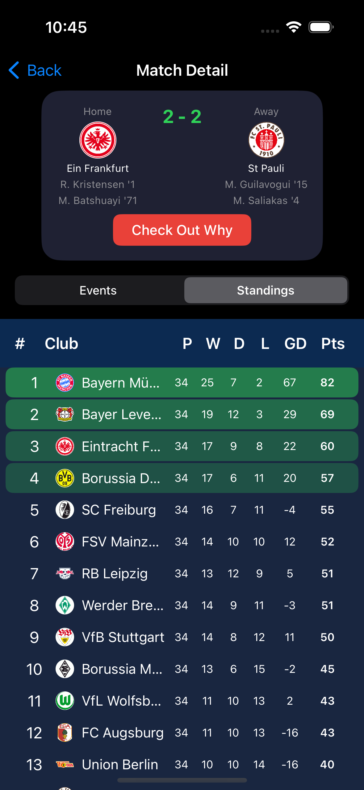
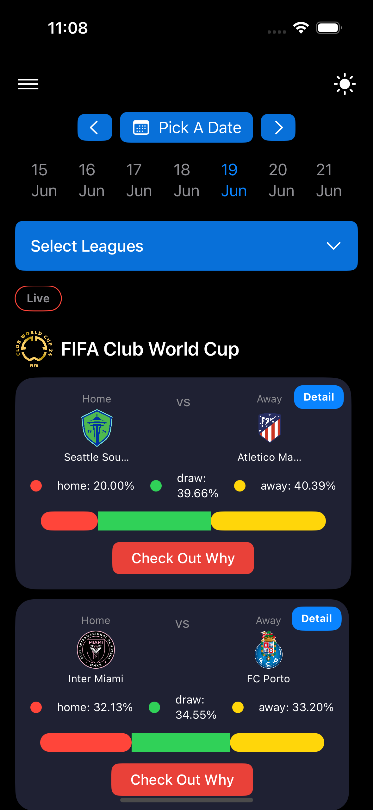
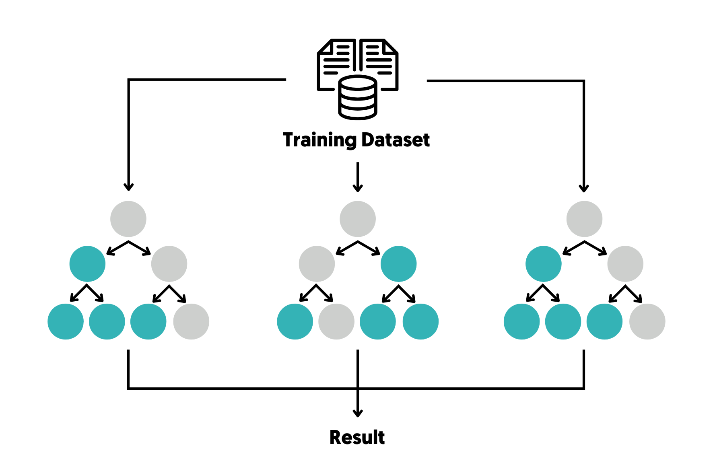
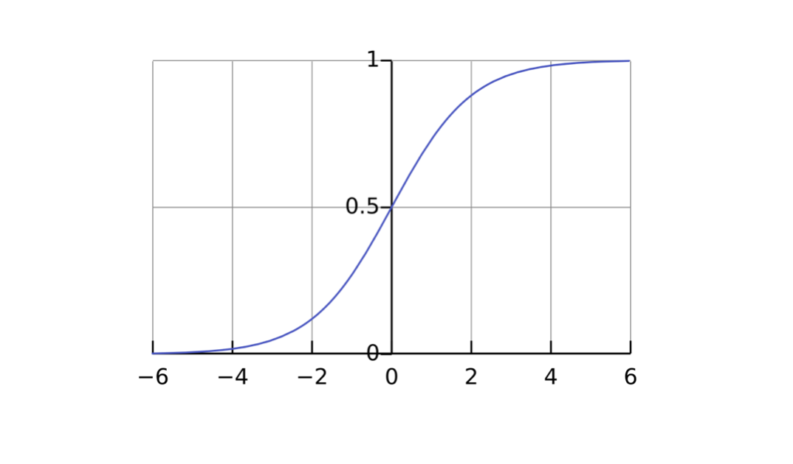
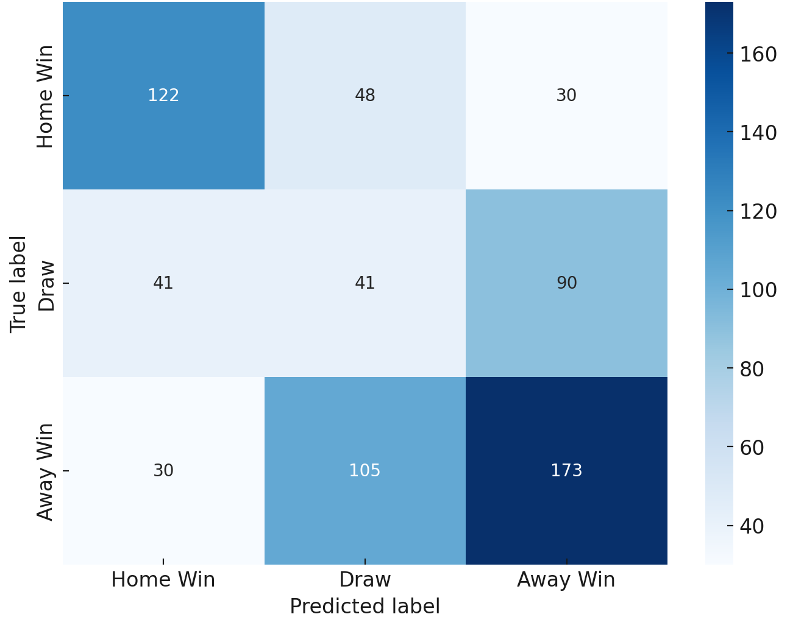

# Football Match Prediction — ML (Pre-Match + Live) with iOS Client

Predict the **Full-Time Result** (Home / Draw / Away) for football matches using Machine Learning.
This project combines a robust Python modeling pipeline with a native **Swift (iOS/macOS)** client to visualize **pre-match** and **live (half-time)** probabilities.

<p align="center"></p>

---

## ✨ Highlights
- **Leagues**: EPL, La Liga, Serie A, Bundesliga, Ligue 1, **Turkish Süper Lig**, FIFA Club World Cup, and UEFA/World Cup Qualifiers.
- **Two modes**:
  1) **Pre-Match** — trained on multi-season historical data + engineered features + market odds.
  2) **Live** — updates at **half-time** (and optionally per event window) using score, cards, and **live odds**.
- **Explainability**: Feature importances and (optionally) SHAP examples for case-by-case interpretation.
- **Client App**: Native SwiftUI with standings, fixtures, match detail, and live probabilities.

---

## 🧠 Approach (Hybrid Overview)

### Data Sources
- Historical CSVs (multi-season): fixtures, scores, cards, **odds**, optional **xG**.
- Live API (BYO key): fixtures, **live odds**, HT/FT score, cards, events.
- Labels are 3-class outcomes: `HomeWin`, `Draw`, `AwayWin`.

Data folder convention:
```
data/
  raw/                     # original CSVs by league/season
  processed/
    matches_clean.parquet
    features_pre_match.parquet
    features_live.parquet
```

### Feature Engineering
- **Recent form (last-5)**: `WinRate`, `DrawRate`, `LossRate`, `GoalsFor/Against` (rolling means).
- **Comparative deltas**: `WinRateDiff`, `DrawRateDiff`, `xG_diff`, `EloDiff`.
- **Elo momentum**: `EloChange30`, `EloChange60`.
- **Market prior**: Odds → probability (`HomeProb`, `DrawProb`, `AwayProb`) with margin adjustment.
- **Live features**: `HTHG`, `HTAG`, encoded `HTR`, yellow/red cards (`HY/AY/HR/AR`), **live odds**.

<p align="center"></p>

### Models
- **Primary**: `RandomForestClassifier`, `LogisticRegression`
- **Benchmark**: `XGBoost` (multi-class softprob)
- **Training**: stratified by season (avoid leakage), standardization for linear models, optional class weighting.

### Evaluation
- **Classification**: Accuracy, macro/micro **F1**, **LogLoss**.
- **Calibration**: Reliability curves (ECE).
- **Live uplift**: compare pre-match vs half-time predictions on the same fixtures.

Example (replace with your exact results):
```
Pre-Match (LogReg): Acc 0.54 | Macro-F1 0.48 | LogLoss 1.07
Pre-Match (RF)    : Acc 0.56 | Macro-F1 0.50 | LogLoss 1.03
Live (RF @HT)     : Acc 0.61 | Macro-F1 0.57 | LogLoss 0.94
```

<p align="center"></p>

---

## 🏗️ Architecture
```
[Data Ingest] -> [Clean & Normalize] -> [Feature Engineering]
       |                                   |        |
       v                                   v        v
  data/processed/*.parquet        notebooks/*.ipynb  scripts/*.py
                   \                   |                  |
                    \-> [Model Train & Eval] -> [Artifacts: models/, reports/]
                                               \
                                                -> [JSON API / iOS App]
```

- **Python**: ETL + modeling + export predictions to CSV/JSON for the app.
- **Swift iOS**: loads JSON (local or via lightweight backend) and renders UI.

<p align="center"></p>

---

## 📦 Project Structure
```
.
├─ assets/
│  ├─ figures/                  # extracted figures from the report
│  └─ screens/                  # app-like screenshots (if any in report)
├─ data/
│  ├─ raw/
│  └─ processed/
├─ models/
│  ├─ rf_pre_match.joblib
│  ├─ logreg_pre_match.joblib
│  └─ rf_live.joblib
├─ notebooks/
│  ├─ 01_exploration.ipynb
│  ├─ 02_feature_engineering.ipynb
│  ├─ 03_train_pre_match.ipynb
│  └─ 04_train_live.ipynb
├─ scripts/
│  ├─ make_features.py
│  ├─ train_pre_match.py
│  ├─ train_live.py
│  ├─ predict_pre_match.py
│  └─ predict_live.py
├─ ios/
│  └─ FootballPred/             # Swift project (SwiftUI)
├─ reports/
│  └─ predictions.json / *.csv
├─ requirements.txt
└─ README.md
```

---

## ⚙️ Setup
```bash
# Python 3.10+
python -m venv .venv
source .venv/bin/activate   # on Windows: .venv\Scripts\activate
pip install -r requirements.txt
```

Minimal `requirements.txt` (edit to your needs):
```
pandas
numpy
scikit-learn
xgboost
scipy
joblib
matplotlib
seaborn
jupyter
pyyaml
```

---

## ▶️ Usage

### 1) Prepare Features
```bash
python scripts/make_features.py \
  --raw_dir data/raw \
  --out_dir data/processed \
  --with_xg \
  --with_odds
```

### 2) Train
```bash
# Pre-match
python scripts/train_pre_match.py \
  --features data/processed/features_pre_match.parquet \
  --model_out models/rf_pre_match.joblib \
  --algo rf \
  --seed 42

# Live (half-time)
python scripts/train_live.py \
  --features data/processed/features_live.parquet \
  --model_out models/rf_live.joblib \
  --algo rf \
  --seed 42
```

### 3) Predict
```bash
# Pre-match predictions for upcoming fixtures
python scripts/predict_pre_match.py \
  --model models/rf_pre_match.joblib \
  --fixtures data/processed/upcoming_fixtures.parquet \
  --out reports/prematch_predictions.csv

# Live predictions at half-time for ongoing matches
python scripts/predict_live.py \
  --model models/rf_live.joblib \
  --live_feed data/processed/live_snapshot.parquet \
  --out reports/live_ht_predictions.csv
```

**Outputs**
- CSV with `home_prob`, `draw_prob`, `away_prob` per match.
- Optional JSON for iOS app: `reports/predictions.json`.

---

## 📱 iOS App (SwiftUI)
- **Stack**: SwiftUI, async networking, simple caching.
- **Data Flow**: Fetch `predictions.json` (local file or a tiny backend endpoint).
- **Views**: Home (leagues & date), Match List, Match Detail (events, odds, probabilities).
- **Build**: open `ios/FootballPred/*.xcodeproj` and run on iOS 16+.

<p align="center"></p><p align="center"></p><p align="center"></p><p align="center"></p><p align="center"></p><p align="center"></p><p align="center"></p><p align="center"></p>

---

## 📊 Visualizations
After training, you can generate and add plots such as:
- Feature Importance
- Calibration Curve
- Confusion Matrix
- Live vs Pre-Match probability comparison

<p align="center"></p><p align="center"></p><p align="center"></p><p align="center"></p><p align="center"></p><p align="center"></p><p align="center"></p><p align="center"></p>

> All images above are extracted from the original project report.
> If you add new plots, place them under `assets/figures/` and reference in this README.

---

## 🗺️ Roadmap
- SHAP summary & per-match force plots in the app
- Minute-level live updates (not just HT)
- Player-level features (injuries, suspensions)
- Bayesian calibration for probabilities
- Lightweight **FastAPI** service for predictions

---

## 👤 Author
**Created by Elif Dikmen**

If you use this code in academic work, please cite the repository or link back to this README.

---

## 📄 License
**MIT** — see [`LICENSE`](LICENSE).
