# ⚽️ FOOTBALL MATCH PREDICTION USING MACHINE LEARNING

The study explores the use of machine learning for predicting both future and live football match outcomes using data from major European leagues and international tournaments. Three models, **XGBoost, Random Forest, and Logistic Regression** were evaluated using pre-2023 data for training and 2023+ matches for testing. Based on metrics like accuracy, precision, recall, and F1-score, Random Forest achieved the best overall performance, while Logistic Regression performed slightly better in two leagues for future match predictions.

For more detailed information, you can read the full thesis in the [📄 **Football Match Prediction PDF**](FOOTBALLMATCHPREDICTION.pdf).


---

## ⚙️ Overview

The project involves developing a web-based sports match prediction application for macOS and iOS, integrating machine learning models trained on historical sports data. Models were developed in **Python (Jupyter Notebook)** using **TensorFlow, Scikit-Learn, Pandas, and NumPy**, then deployed via a **backend service accessible through API requests**. The mobile app—built with Xcode and Swift—retrieves predictions and live updates from this backend, ensuring real-time accuracy without local computation. An active internet connection is required since predictions are processed server-side and refreshed every minute during live matches. This architecture enables up-to-date analytics and minimizes device resource usage while maintaining high performance and responsiveness.

The model leverages historical and live match data from:
- Premier League, La Liga, Serie A, Bundesliga, Ligue 1
- Turkish Super League
- FIFA Club World Cup & World Cup Qualifiers

The system predicts outcomes as Home Win, Draw, or Away Win, using:
- **Random Forest**
- **XGBoost**
- **Logistic Regression**

---

## 🏗️ System Architecture

<p align="center">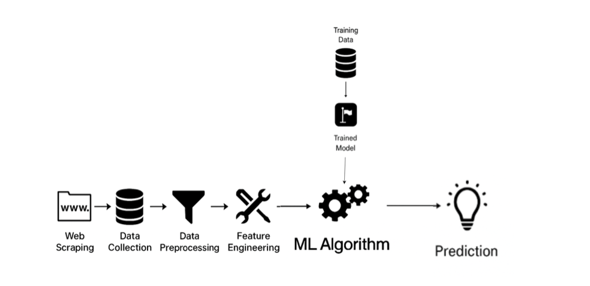</p>
The system uses a modular pipeline architecture with sequential stages: data collection, preprocessing, feature engineering, training, and prediction. Data is gathered via web scraping, APIs, and open datasets, then standardized and cleaned. Engineered features like ELO ratings, form ratios, and probabilistic odds enhance prediction quality. Machine learning models (e.g., Random Forest, Logistic Regression) are trained and optimized through cross-validation. The final model provides both pre-match and live predictions, ensuring a scalable, maintainable, and extensible system design.

---
## 🟥 Diagrams
 
- **Sequence Diagram**
  
The two sequence diagrams illustrate the system’s core behaviors. The **left diagram** shows how pre-match predictions are loaded at app startup—using cached results from the database when available or generating new ones via the ML model when not. The **right diagram** depicts the “Detail” feature flow, where the app retrieves team standings and live match events either from the database or, if missing, through real-time API calls—ensuring efficient, up-to-date insights with minimal resource use.

<p align="center">
  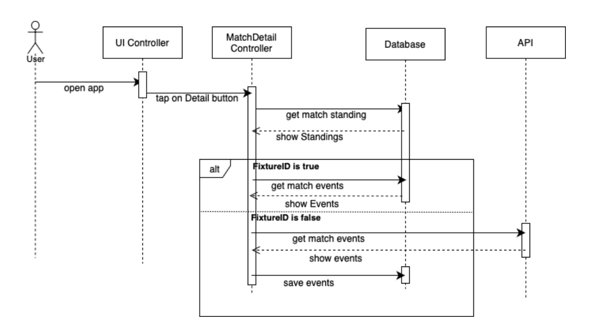
  &nbsp;&nbsp;
  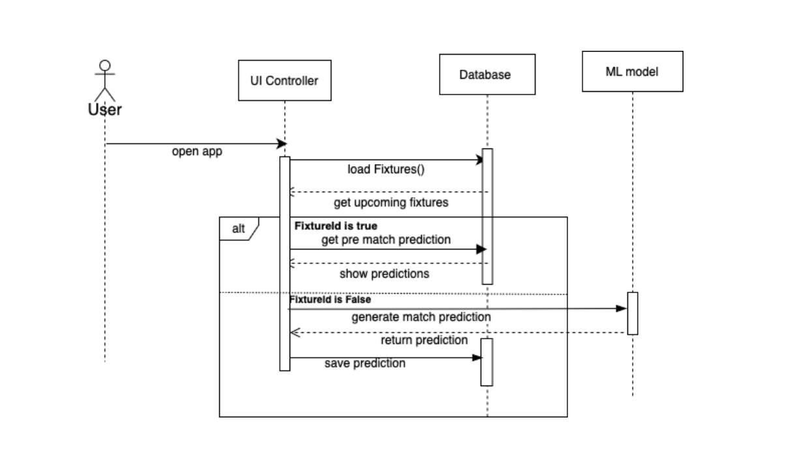
</p>

- **Use Case Diagram**

The use case diagram illustrates how the User interacts with the football match prediction system through key functions. Users can view upcoming and live matches, access pre-match and live predictions, and explore detailed insights like match statistics, events, and team standings. Additional options such as selecting date or league help filter results, highlighting the system’s ability to handle both static (pre-match) and real-time (live) prediction features efficiently.

<p align="center">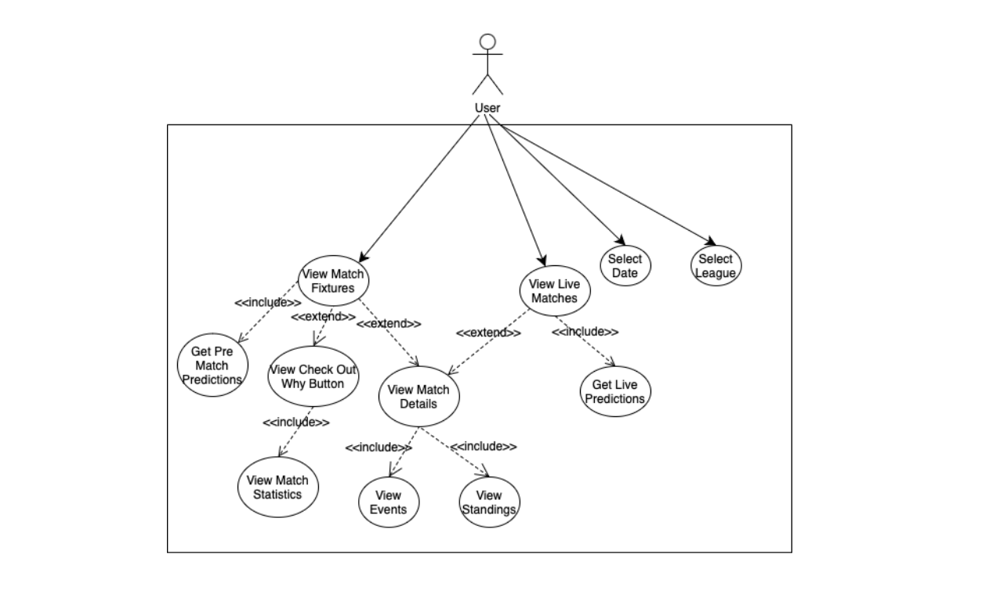</p>

- **Database E-R Diagram**

The relational database model of the system, built to manage match data, predictions, and standings. It includes four main tables: fixtures (core match data and results), events (match incidents linked by FixtureID), prediction_info (aggregated stats for prediction), and standings (league rankings for display). The structured schema ensures efficient querying, clear data separation, and easy scalability for future expansions.

<p align="center">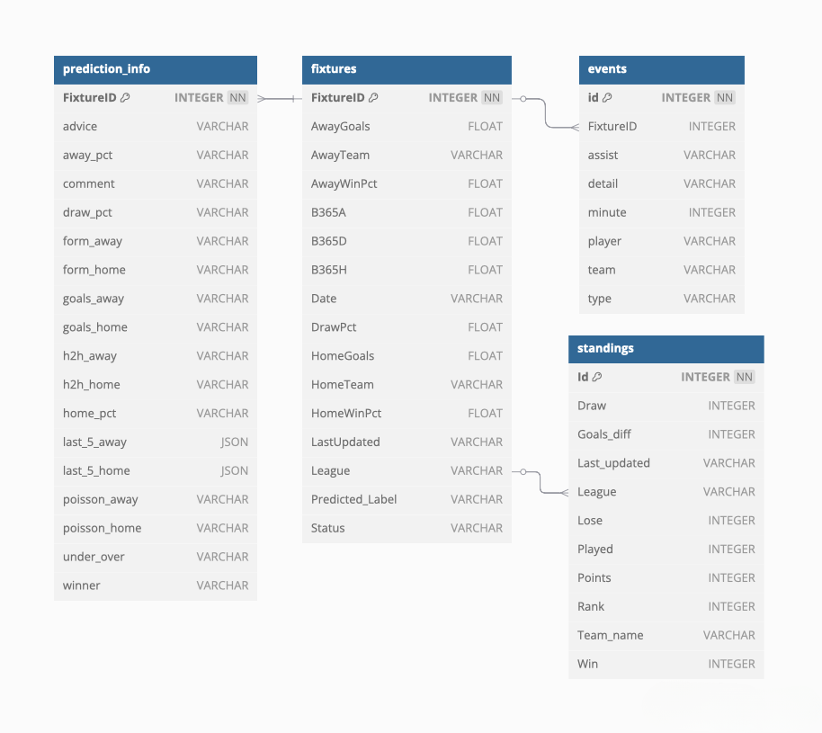</p>


 


## 🧠 Implementation

### 1. Data Collection
- Historical data (2014–2025) from Kaggle and football APIs
- Web-scraped features: **Expected Goals (xG)**, team form, betting odds
- Live API: fixtures, **live odds**, HT/FT score, cards, events.


### 2. Data Preprocessing
- **Missing value imputation and Data Cleaning**
- **Label encoding & normalization**
- **Feature engineering**: 
   - **Recent form (last-5)**: `WinRate`, `DrawRate`, `LossRate`, `GoalsFor/Against`.
   - **Comparative deltas**: `WinRateDiff`, `DrawRateDiff`, `xG_diff`, `EloDiff`.
   - **Elo momentum**: `EloChange30`, `EloChange60`.
   - **Market prior**: Odds → probability (`HomeProb`, `DrawProb`, `AwayProb`) with margin adjustment.
   - **Live features**: `HTHG`, `HTAG`, encoded `HTR`, yellow/red cards (`HY/AY/HR/AR`), **live odds**.
   - **Feature Selection**
      - The feature importance analysis gave a full picture of how each feature contributed to the predictions of the model. Some features were high in importance, indicating that they were major contributors to the decision-making of the model. The rest of the features had very low importance scores, they contributed very little to the predictions. Features with normalized importance scores below 0.01 were not included in the final model. This threshold was se- lected to eliminate variables that had little predictive contribution but retain possible useful small effects.
     
  <p align="center">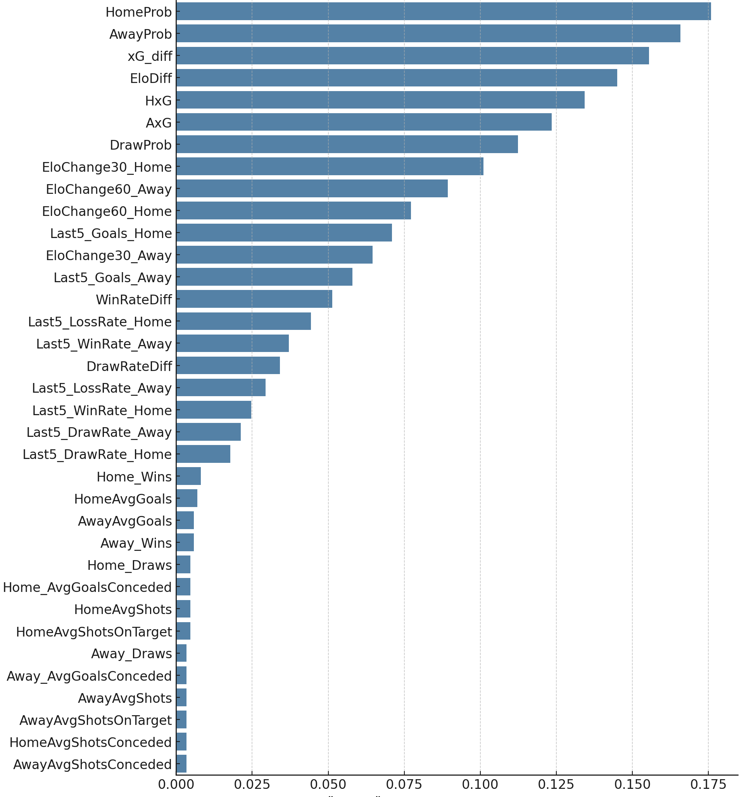</p>
  
- **Live Match Model and Real-Time Feature Integration**
- **Standarization and Merging of League Datasets**
- **Final Dataset Structure**


### 3.Machine Learning Algorithms
 -**Random Forest**:Builds multiple decision trees and aggregates their results to improve accuracy and prevent overfitting. It handled complex, league-specific data well and achieved strong generalization, especially in leagues with rich historical data.
 -**Extreme Gradient Boosting**:A fast, regularized ensemble model using gradient boosting, optimized with hyperparameter tuning. It managed multiclass classification effectively and showed consistent, high performance across leagues due to its scalability and flexibility.
 -**Logistic Regression**:A simpler, interpretable baseline model using normalized features and cross-validation. Though less powerful than ensemble methods, it provided stable and explainable results, helping understand feature influence on match outcomes.


### 4.Model Selection

Three machine learning models—Random Forest, XGBoost, and Logistic Regression—were tested across eight football leagues to find the most effective predictor. Random Forest achieved the best overall performance, selected for six leagues due to its ability to handle complex, non-linear data and high F1-scores. Logistic Regression was chosen for two leagues (E0 and T1) for its simplicity and balanced performance. XGBoost underperformed, particularly on the “draw” class, and was not used in final deployment. All models were optimized using GridSearchCV with stratified cross-validation, confirming Random Forest as the most reliable and robust model overall.


### 5.Live Prediction

This section describes a separate live match prediction model that updates dynamically using real-time data such as goals, cards, half-time scores, and betting odds. By continuously adjusting probabilities during the match, it enables mid-game predictions, making it valuable for in-play betting and live coaching analysis.


<p align="center">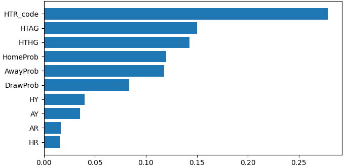</p>

---


## 📱User Interface 

The homepage offers a simple and user-friendly interface showing the calendar and daily match list. Live and upcoming matches are displayed in separate sections. Users can switch between them using the Live Match button, view prediction summaries, check detailed match info like standings and events via the Details button, and use filters to display matches for specific teams.

<p align="center">
  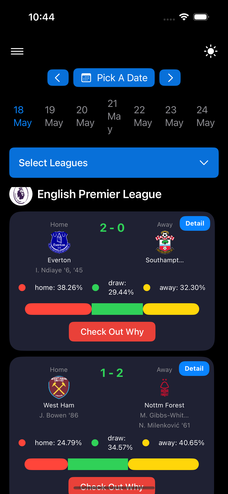
  &nbsp;&nbsp;
  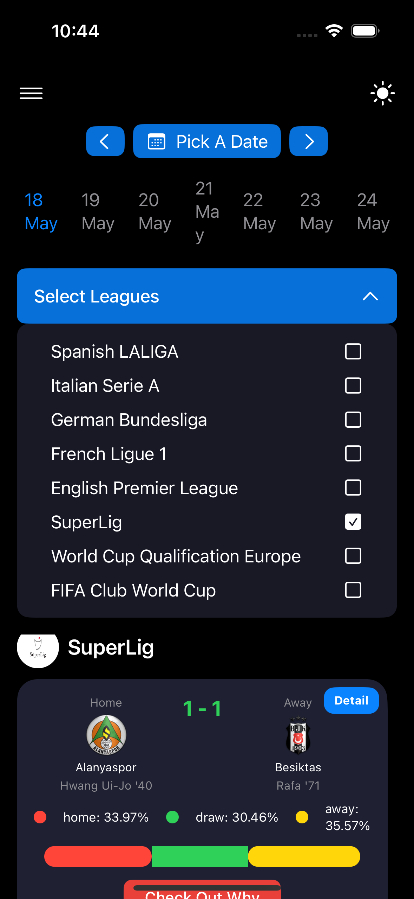
  &nbsp;&nbsp;
  
  &nbsp;&nbsp;
</p>


<p align="center">
  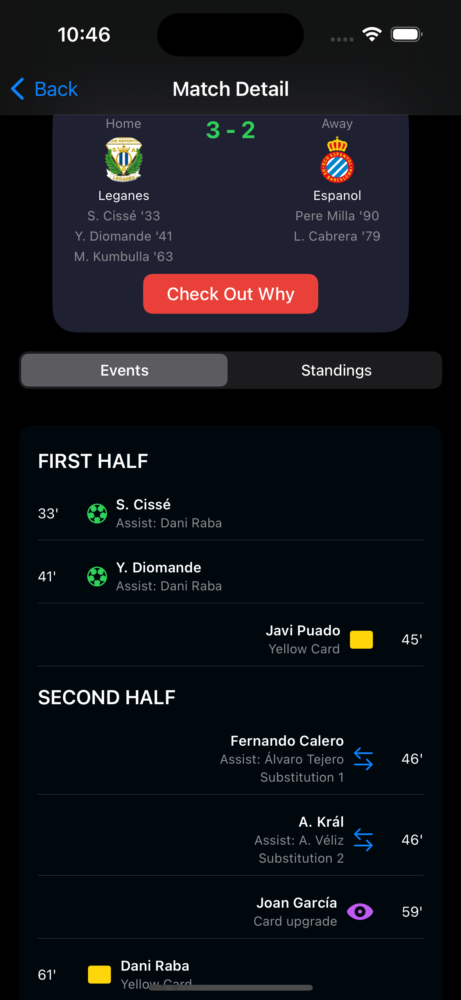
  &nbsp;&nbsp;
  
  &nbsp;&nbsp;
  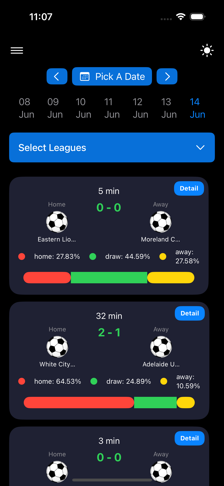
  &nbsp;&nbsp;
</p>


---

## ✅ TEST AND RESULTS

This chapter evaluates the performance and real-world applicability of machine learning models for predicting football match outcomes (Home Win, Draw, Away Win). Models were trained on historical data and tested both on past and future matches to assess generalization. Random Forest and Logistic Regression were used across different leagues, achieving an overall accuracy of 57.5% and macro F1-score of 54.3%. While “Draw” outcomes remained hardest to predict, the models maintained strong performance on unseen data—proving that patterns learned from historical matches can effectively forecast real games, validating the practicality of the system for real-world use.

<p align="center">
  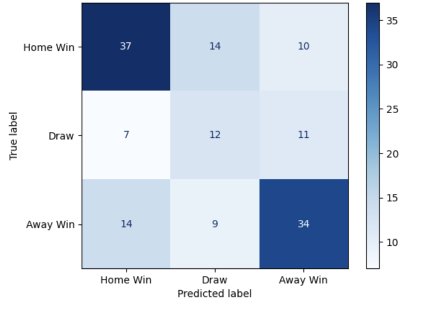
</p>
<p align="center"><b>Figure:</b> Confusion Matrix for all leagues</p>

### Table —  Classification performance metrics of the model

| **Class**     | **Precision** | **Recall** | **F1-Score** | **Support** |
|----------------|---------------|-------------|---------------|--------------|
| **Home Win**   | 0.64          | 0.59        | 0.64          | 68           |
| **Draw**       | 0.34          | 0.40        | 0.37          | 30           |
| **Away Win**   | 0.62          | 0.57        | 0.61          | 63           |
| **Micro Avg**  | 0.56          | 0.54        | 0.55          | 161          |
| **Macro Avg**  | 0.53          | 0.52        | 0.54          | 161          |
| **Weighted Avg** | 0.57        | 0.54        | 0.57          | 161          |

**Accuracy:** 57.5%

---

## 💭 Conclusion

This project developed a machine learning-based football match prediction system covering eight leagues. Using historical data, ELO ratings, and betting odds, three models—Logistic Regression, Random Forest, and XGBoost—were trained and evaluated via cross-validation and macro F1-score. Logistic Regression was chosen for the English Premier League and Turkish Super League, while Random Forest was used for the remaining leagues. The models were deployed through a Flask REST API integrated with a Swift-based mobile app for real-time predictions. Although overall accuracy was strong, draw outcomes were harder to predict. Limitations include missing player-level data, weather, and referee effects, and the system predicts only match results, not exact scores.


---

## ⚙️ Setup
```bash
# Python 3.10+
python -m venv .venv
source .venv/bin/activate   # on Windows: .venv\Scripts\activate
pip install -r requirements.txt
python3 app.py
```

Minimal `requirements.txt`:
```
pandas
numpy
scikit-learn
xgboost
scipy
joblib
matplotlib
seaborn
jupyter
pyyaml
```

---
**Outputs**
- CSV with `home_prob`, `draw_prob`, `away_prob` per match.
- Optional JSON for iOS app: `reports/predictions.json`.

---

## Automated fixture pipeline

The relational database is the source of truth for the mobile API. Five major
European leagues are batch-synced from football-data.org and Süper Lig is
synced from the CC0 OpenFootball dataset. If the requested Süper Lig season
has not been published there yet, the keyless ESPN scoreboard feed is used as
a fallback. New fixtures and schedule changes are upserted, then only fixtures
marked `needs_prediction` are passed to the saved models.

Production scheduling is defined in `.github/workflows/sync-football-data.yml`:

- `full` fetches the next 45 days every day at 02:17 UTC.
- `refresh` fetches yesterday through the next two days every three hours.
- Both jobs write fixtures and predictions to the database configured by
  `DATABASE_URL`.

Add these repository secrets in **Settings → Secrets and variables → Actions**:

- `DATABASE_URL`: the Supabase Postgres pooler connection string.
- `FOOTBALLDATATOKEN`: a free football-data.org API token.
- `API_FOOTBALL_KEY`: used for live matches, events and the nightly Süper Lig
  standings refresh.

Süper Lig standings run at 23:00 Türkiye time. A midnight fallback runs only
when the first attempt could not update the table. Days without Süper Lig
fixtures do not consume an API request.

Optional repository variable `OPENFOOTBALL_SEASON` can pin the Süper Lig feed
to a value such as `2025-26`. Without it, the job tries the current season and
falls back to the most recently published dataset.

For local development copy `.env.example` to `.env`. Without `DATABASE_URL`,
the code continues to use `matches.db`. Run a complete sync manually with:

```bash
python sync_pipeline.py --mode full
```

The Flask routes `/prediction-dates`, `/scheduled-predictions`,
`/prediction/<fixture_id>`, and `/predictionmatch` read directly from the
database. Provider credentials stay on the server and are never embedded in
the iOS application. Pre-match recalculations are appended to
`prediction_snapshots`; live predictions use a separate `LIVE` type and never
overwrite the pre-match probabilities stored on the fixture.

---

## 👤 Author
**Created by Elif Dikmen**

If you use this code in academic work, please cite the repository or link back to this README.

---

## 📄 License
**MIT** — see [`LICENSE`](LICENSE).
